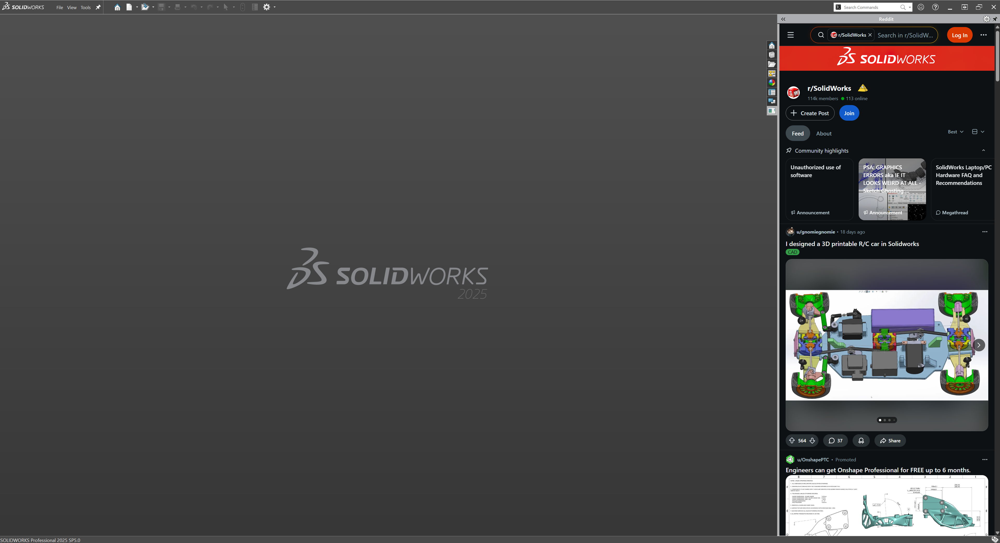

# SolidWorks Reddit Sidebar

Browse Reddit without leaving SolidWorks. This free add-in places a Reddit browser right in your sidebar, perfect for checking r/SolidWorks while waiting for rebuilds or looking up solutions to modeling problems.



## What This Does

Once installed, a new "Chatter" panel appears in your SolidWorks sidebar. Click it to open Reddit, pre-loaded to r/SolidWorks. You can browse, search, and read posts without switching windows or losing focus on your CAD work.

## Installation

**Before you start:** Make sure SolidWorks is completely closed.

### Step 1: Download

Go to the [Releases page](https://github.com/kilwizac/solidworks-reddit/releases/latest) and download the ZIP file (it will be named something like `solidworks-reddit-v1.0.0.zip`).

### Step 2: Extract the files

Find the downloaded ZIP in your Downloads folder. Right-click it and select "Extract All..." then click "Extract". This will create a new folder with the installation files inside.

### Step 3: Run the installer

Open the extracted folder. You should see a file called `install.bat`.

**Important:** Right-click on `install.bat` and select "Run as administrator". This is required because the add-in needs to register itself with Windows.

A black command window will briefly appear and then close. This is normal.

### Step 4: Open SolidWorks

Start SolidWorks. Look at the tabs on the right side of your screen (the same area where FeatureManager and PropertyManager appear). You should see a new "Chatter" tab. Click it to open Reddit.

## Requirements

- **SolidWorks 2020 or newer** (any edition: Standard, Professional, or Premium)
- **Windows 10 or Windows 11** (64-bit)
- **WebView2 Runtime** (usually already installed on modern Windows systems)

## Troubleshooting

### The Chatter tab does not appear

1. Go to **Tools** in the menu bar
2. Click **Add-Ins...**
3. Look for "Chatter Reddit" in the list
4. Check both boxes next to it (this enables it now and at startup)
5. Click OK

If "Chatter Reddit" is not in the list at all, the installation may have failed. Try running `install.bat` again, making sure to right-click and select "Run as administrator".

### The panel is blank or shows a white screen

This means the WebView2 browser component is not installed on your computer. Here is how to fix it:

1. Go to [Microsoft's WebView2 download page](https://developer.microsoft.com/microsoft-edge/webview2/)
2. Scroll down to "Evergreen Bootstrapper" and click "Download"
3. Run the downloaded installer
4. Restart SolidWorks

### The installation window closes immediately without any message

This is actually normal behavior. The installer runs silently. Try opening SolidWorks to see if the add-in appears. If it does not, make sure you right-clicked the installer and selected "Run as administrator".

### I see an error about permissions or access denied

You must run the installer as an administrator. Right-click `install.bat` and specifically choose "Run as administrator" from the menu. If you just double-click the file, it will not have the necessary permissions.

### The add-in worked before but stopped working after a SolidWorks update

SolidWorks updates can sometimes reset add-in settings. Go to **Tools > Add-Ins** and re-enable "Chatter Reddit" by checking both boxes.

## Uninstalling

If you want to remove the add-in:

1. Close SolidWorks completely
2. Go to the folder where you extracted the installation files
3. Right-click `uninstall.bat` and select "Run as administrator"
4. The add-in is now removed

---

# For Developers

Everything below this line is for developers who want to modify or build the add-in from source code.

## Prerequisites

- SolidWorks 2020 or later (the build process needs the API libraries)
- .NET SDK 8.0 or newer
- .NET Framework 4.8

## Project Structure

```
solidworks-reddit/
├── ChatterSolidworks.csproj    # Project configuration
├── SwAddin.cs                  # Main add-in entry point
├── Controls/
│   └── RedditTaskPaneControl.cs # The WebView2 browser panel
├── Properties/
│   └── AssemblyInfo.cs
├── build.bat                   # Compiles the project
├── register.bat                # Registers the DLL with Windows
├── unregister.bat              # Removes the registration
├── reinstall.bat               # Does all three: unregister, build, register
└── global.json                 # Specifies the .NET SDK version
```

## Building

The simplest approach is to use the provided batch files:

```cmd
# Just compile the code
build.bat

# Full cycle: unregister old version, build new version, register it
# (Run this as administrator)
reinstall.bat
```

You can also build directly with the .NET CLI:

```cmd
dotnet build
dotnet build -c Release
```

## Custom SolidWorks Installation Path

If SolidWorks is not installed in the default location, you have two options:

**Option 1:** Pass the path during build:
```cmd
dotnet build /p:SolidWorksPath="D:\Your\Path\To\SOLIDWORKS"
```

**Option 2:** Set an environment variable called `SOLIDWORKS_INSTALL_PATH` to your SolidWorks installation folder.

## Development Workflow

1. Make your code changes
2. Run `reinstall.bat` as Administrator (this unregisters the old version, builds, and registers the new one)
3. Start SolidWorks to test your changes

Note: You must restart SolidWorks each time you rebuild. SolidWorks loads add-ins at startup and does not reload them while running.

## Debugging

1. Build in Debug configuration
2. Register the add-in using `register.bat`
3. Start SolidWorks
4. In Visual Studio, go to **Debug > Attach to Process**
5. Find and select `SLDWORKS.exe`
6. Set breakpoints in your code

## Useful Resources

- [SolidWorks API Documentation](https://help.solidworks.com/2023/english/api/sldworksapiprogguide/welcome.htm)
- [WebView2 Getting Started Guide](https://learn.microsoft.com/en-us/microsoft-edge/webview2/)

## License

This project is released under the MIT License. See the [LICENSE](LICENSE) file for details.
